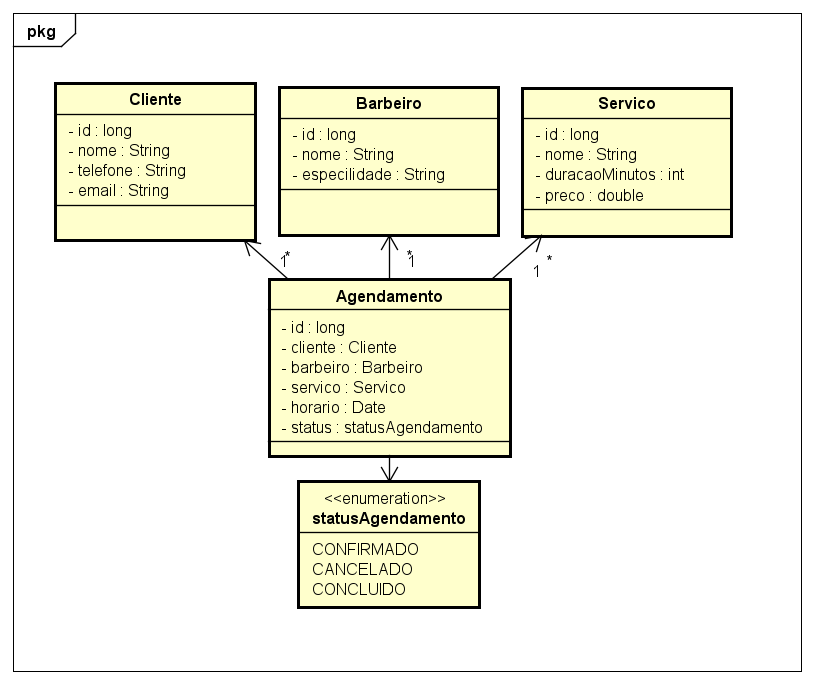

# Modelagem – Sistema de Agendamento de Barbearia

## 1. Descrição do projeto

Um cliente agenda um horário com um barbeiro para um serviço específico, em uma
data e hora determinadas. Um barbeiro não pode ter dois agendamentos no mesmo
horário.

## 2. Substantivos candidatos à classe

| Substantivo | Vira classe? | Motivo |
| --- | --- | --- |
| Cliente | Sim | Tem identidade própria e comportamento (histórico de agendamentos) |
| Barbeiro | Sim | Tem identidade própria e comportamento (agenda de horários) |
| Serviço | Sim | Entidade reutilizável (nome, duração, preço) referenciada por vários agendamentos |
| Agendamento | Sim | Concentra a regra de negócio principal (conflito de horário) | 
| Data/Hora | Não | Vira atributo `LocalDateTime` dentro de `Agendamento`, não tem identidade própria |

## 3. CRC-Cards (Class-Responsability-Collaborator)

| Classe | Responsabilidade                                     | Colabora com |
| --- |------------------------------------------------------| --- |
| Cliente | Guardar dados pessoais; ter histórico de agendamento | `Agendamento` |
| Barbeiro | Guardar dados pessoais; ter uma agenda de horários | `Agendamento` |
| Serviço | Guardar nome, duração e preço | `Agendamento` | 
| Agendamento | Ligar cliente + barbeiro + serviço + horário; validar conflito de agenda | `Cliente`, `Barbeiro`, `Serviço` |

## 4. Atributos por classe

**Cliente**

- `id: Long`
- `nome: String`
- `telefone: String`
- `email: String`

**Barbeiro**
- `id: Long`
- `nome: String`
- `especialidade: String`

**Serviço**
- `id: Long`
- `nome: String`
- `duracaoMinutos: int`
- `preco: double`

**Agendamento**
- `id: Long`
- `cliente: Cliente`
- `barbeiro: Barbeiro`
- `servico: Servico`
- `horario: LocalDateTime`
- `status: StatusAgendamento` (enum: `CONFIRMADO`, `CANCELADO`, `CONCLUIDO`)

## 5. Diagrama de classes

## 6. Validação com casos de uso
| Caso de uso | O modelo suporta? | Observação                                                                                                        |
| --- | --- |-------------------------------------------------------------------------------------------------------------------|
| Cliente cancela uma agendamento | Sim | Alterar `status` para `CANCELADO`                                                                                 |
| Barbeiro tem dois serviços no mesmo horário | Não | Regra de negócio para validar na camada de serviço, comparando `horario` + `barbeiro` antes de salvar             |
| Cliente vê histórico de agendamentos | Sim | Consultar por `cliente.id` na tabela agendamentos                                                                 |
| Serviço é removido do catálogo mas já tem agendamentos antigos | A decidir | Considerar soft delete (`ativo: boolean`) em vez de exclusão física, para não quebrar agendamentos existentes |

## 7. Decisões em aberto
- [ ] Soft delete em `Servico`?

---
*Última atualização: Fase 0 – 14/07/2026*